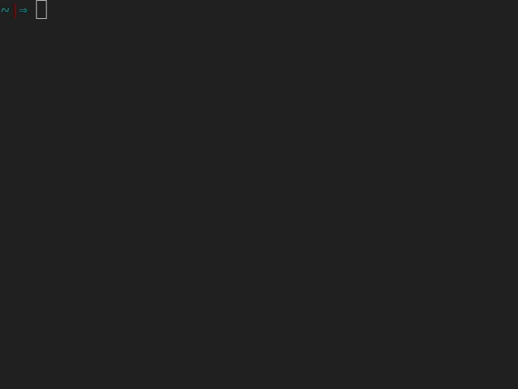

# almanac_c
 Simple command line calendar utility. Written in C.
- Keep in mind that this is my first actual C program.
- Help, suggestions, criticism and pull requests are welcome.

## Demo
Green color indicates current date and yellow is a date with note (significant date)

<p align="center">

</p>

## Usage

Print calendar of current month
```sh
$ cal
```

Print the note of a date (if there is one)
```sh
$ cal <date_num>
```

Add a note to a date
```sh
$ cal sig <date_num>
```

## Installation
```sh
$ mkdir bin
$ make && make install
```
